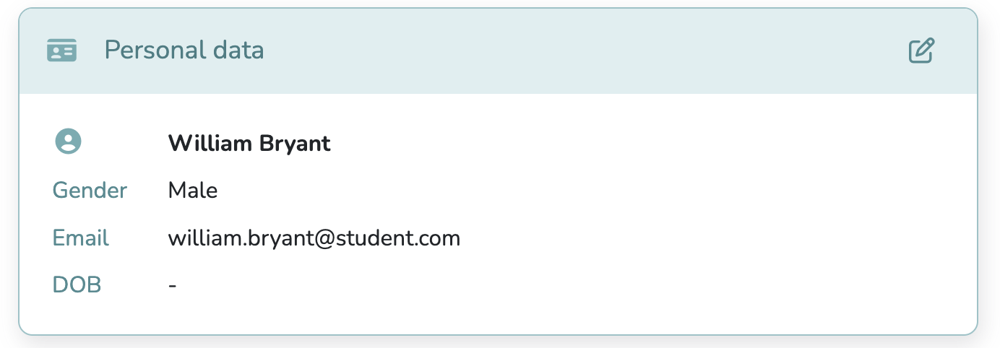
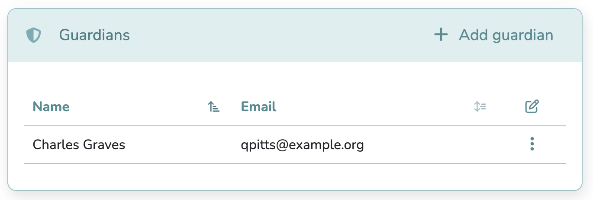
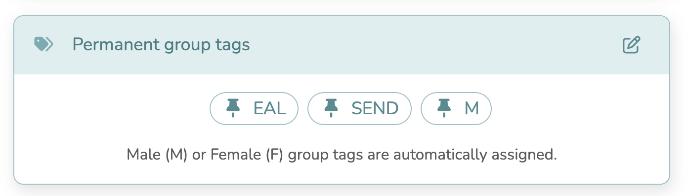
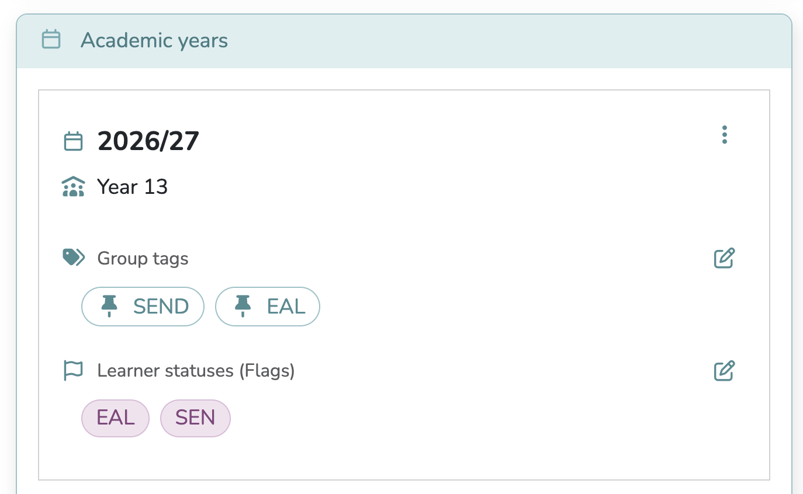
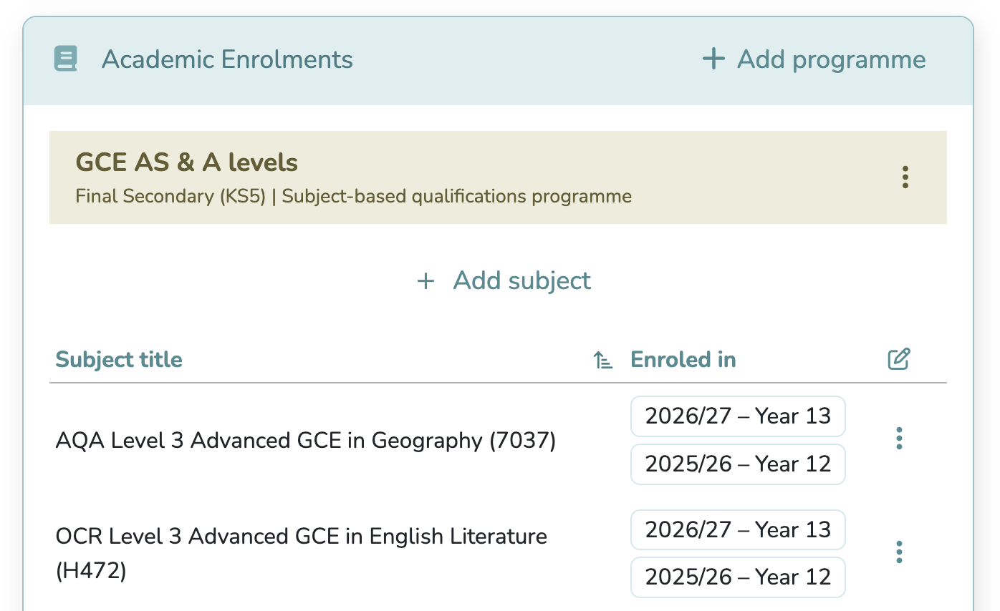
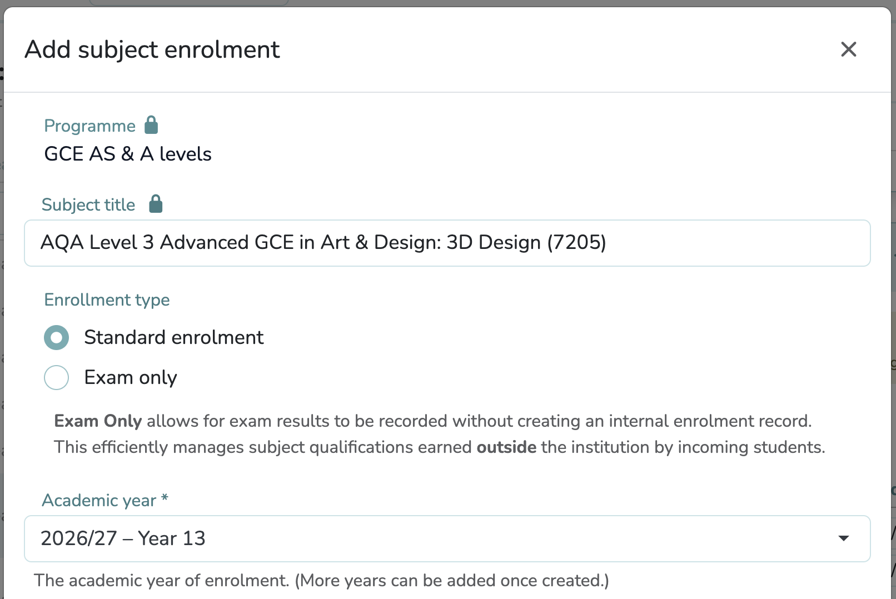
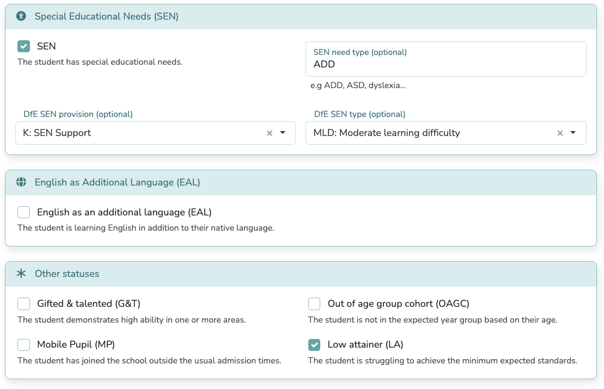
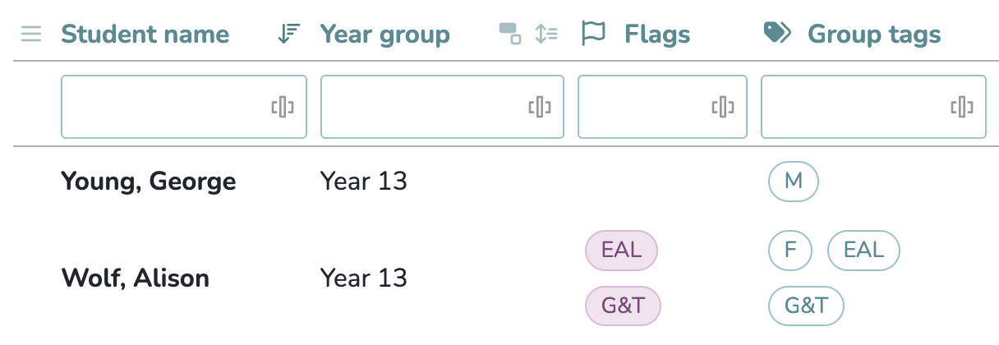

# The Student Setup Guide

## The Student Profile

To register a new student, click the `Add student` button. Then provide the student's First Name and Last Name—these are the only required fields. Once saved, you will be redirected to the student's profile.

The student profile consists of **five** sections: **Personal Data**, **Guardians**, **Permanent Group Tags**, **Academic Years** and **Academic Enrolments**. Each section contains specific fields that you need to complete to set up a student's record in Gradewing.

### 1. Personal Data

This section allows you to review or update the student's information as needed.
The 'Gender' field is optional, but providing it allows you to compare grades by gender.

### 2. Guardians (Optional but Recommended)

You should assign at least one guardian to each student to enable secure report sharing. By adding guardians, you enable Gradewing to send reports directly to the appropriate contacts on your behalf. You can add multiple guardians if needed.

### 3. Permanent Group Tags (Optional)

You can assign any number of **permanent group tags** to the student, which will apply across **all** their academic years. 
See the [Group Tags](#group-tags) section to learn more.

### 4. Academic Years

The enrolment process requires you to enrol each student in an **Academic Year** and **Year Group**. This step allows you to assign subjects to the chosen academic year. 

You may also assign **Annual Group Tags** to a student for each academic year; these tags are specific to that year only. See the [Group Tags](#group-tags) section to learn more.

You should mark the appropriate **Learner Statuses** (SEN, EAL, G&T...) for the student in that academic year. See the [Learner Statuses](#learner-statuses) section to learn more.

### 5. Academic Enrolments

You can assign each student to one (and more) programmes. 
A programme is simply a group of subjects from the same educational system and level that a student takes in one or more academic years. 

A programme does not care which academic year the student is enrolled in.

!!! info "Academic Programmes"

    *Final Secondary (KS5)*

    *   **IB Diploma Programme** – All SL, HL, and Core subjects (Theory of Knowledge, Extended Essay, CAS)
    *   **GCE AS & A levels** – All GCE AS and A level subjects from AQA, Edexcel, and OCR
    *   **Level 3 Extended Project Qualifications** –
            All EPQ from AQA, OCR, and Edexcel
    *   **International AS & A levels** – All IAS and IAL subjects from Cambridge (CIE), Edexcel and OxfordAQA
    *   **International Project Qualifications** – International EPQ from Cambridge (CIE) and OxfordAQA
    *   **Other Pre-university (KS5) Programmes** – Custom subjects e.g. PSHE (non-examinable)

    *Upper Secondary (KS4)*

    *   **IB Middle Years Programme (Years 4–5)** – All MYP subjects from the 8 subject groups
    *   **GCSEs** – All GCSE subjects from AQA, Edexcel, and OCR
    *   **Level 1 & 2 Project Qualifications** – All Level 1 & 2 EPQ from AQA, OCR, and Edexcel
    *   **International GCSEs** – All IGCSE subjects from Cambridge (CIE), Edexcel and OxfordAQA
    *   **O Levels** – All O Level subjects from Cambridge (CIE)
    *   **KS4** – Custom KS4 subjects e.g. PSHE (non-examinable)

    *Lower Secondary (KS3)*

    *   **International Lower Secondary Programme** – All subjects from the lower secondary curriculum

After adding a programme, you can enrol the student in any of the subjects within that programme. 
A programme itself is not tied to a specific academic year, but you can only assign subjects to an academic year in which the student is enroled.

#### Subject Enrolment: Standard vs Exam Only

There are two ways to enrol a student in a subject:

* **Standard Enrolment**: For students following the regular internal course. 
You can assign multiple academic years to a single subject if needed.
In fact, this is the recommended way for IB MYP & DP subjects, GCSEs, and A levels.
See the [Assigning Subjects](#subject-assignment) section below for real-world examples and best practices.
* **Exam Only**: For recording exam results without creating an internal enrolment record. This allows you to **record and analyse** prior exam results for 
    - students who joined your school with prior qualifications.
    - all your students during the first year of adoption of Gradewing.

    
Registering KS4 exam results grants GEM the ability to generate accurate **Expected Grades** for KS5 subjects.

!!! tip "Plan subject enrolments carefully"
    For example, for modular IALs, students can be enroled in AS for Y12 and A2 for Y13; for linear A-levels, a two-year enrolment is recommended. See the [Subject Enrolment Guide](#subject-enrolment-guide) section for examples and best practices.

## Learner Statuses

Learner statuses (also called "Learner flags") helps you and other users identify and support students with **specific educational needs**. When enrolling a student in an Academic Year, you can assign one or more of the following statuses:

* **SEN**  (Special Educational Needs) [Includes DfE SEN provision and type]
* **EAL** (English as an Additional Language) [Includes proficiency level]
* **LA** (Low Attainer)
* **G&T** (Gifted & Talented)
* **MP** (Mobile Pupil)
* **OAGC** (Out of Age Group Cohort)

## Group Tags

Group tags are custom labels that you can assign to students to group them based on any characteristic you choose. For example, "SEN", "EAL" or "HA" (High Attainer) are common group tags. Gender tags ("M", "F") are automatically created if the student's gender is provided. 
Group tags are especially useful for comparing academic performance across different student groups in **Group Performance Analysis**, providing valuable insights based on demographics and other characteristics.

A student can have multiple group tags assigned. There are **permanent** group tags that apply across all academic years, and **annual** group tags that are specific to a particular academic year. You can assign both types of tags in the student's profile. Assigning a permanent group tag overrides any annual group tag of the same name. 

!!! info "Group tags vs Learner statuses"
    Group tags and learner statuses help identify and support students with specific needs. 
    However, only group tags are used in group analysis. Tags shared by only a handful of students may not provide meaningful comparisons.

## Subject Enrolment Guide

### GCE AS & A-Level
We recommend a two-year enrolment for (linear) A levels (Y12 and Y13).

| Subject title | Enroled in |
| :--- | :--- |
| AQA Level 3 Advanced GCE in Physics (7408) | 2025/26 – Year 13   2024/25 – Year 12 |
| Pearson Edexcel Level 3 Advanced GCE in Further Mathematics (9FM0) | 2024/25 – Year 12 |
| Pearson Edexcel Level 3 Advanced Subsidiary GCE in Further Mathematics (8FM0) | Exam only |

**Example 1:** The student takes Physics (linear qualification) normally in Y12 and Y13, and takes Further Mathematics in Y12 but drops it in Y13. The student sits the Further Mathematics AS exam in Y13 without lessons, hence the "Exam only" enrolment.

---

### International AS & A levels
For staged linear & modular subjects, we recommend enrolling students in AS subjects for Y12 and A2 subjects for Y13.

| Subject title | Enroled in |
| :--- | :--- |
| Cambridge International GCE A level in Media (9607) | 2025/26 – Year 13 |
| Pearson Edexcel International A level in Mathematics (YMA01) | 2025/26 – Year 13 |
| Cambridge International GCE AS level in Media (9607) | 2024/25 – Year 12 |
| Pearson Edexcel International AS level in Mathematics (XMA01) | 2024/25 – Year 12 |

**Example 2:** The student is enroled in Media (staged qualification) and Mathematics (modular qualification). The student takes the Media AS level exam in Y12 and the A Level level exam in Y13. The student sits some (AS) units in Y12, and the remaining (A2) units in Y13.

    
---

### International Baccalaureate (IB) Diploma
We recommend two-year enrolment for IB DP subjects and core components (TOK, CAS and EE) whenever possible.

| Subject title | Enroled in |
| :--- | :--- |
| IB DP Biology HL (Group 4) | 2025/26 – Grade 12 |
| IB DP Biology SL (Group 4) | 2024/25 – Grade 11 |
| IB DP English A: Lang & Lit HL (Group 1) | 2025/26 – Grade 12   2024/25 – Grade 11 |
| IB DP Theory of Knowledge (TOK) | 2025/26 – Grade 12   2024/25 – Grade 11 |
| IB DP Creativity, Activity, Service (CAS) | 2025/26 – Grade 12   2024/25 – Grade 11 |

**Example 3:** The student takes Biology SL in Grade 11 and decides to take it at HL in Grade 12. The student takes English A: Lang & Lit at HL, TOK and CAS core components across both years.

!!! info "IB Core Components"
    TOK, EE and CAS can be assigned as normal subjects in Gradewing. CAS is given a special grading scale (7/7, 6/7 ... 0/7) which reflects the state of completion of the seven CAS learning outcomes.

---

### IGCSE / GCSE / O levels (Upper Secondary)
We recommend enroling students in (I)GCSE or O-level subjects for the entire duration of their KS4 (Y10 and Y11).

**Non-examinable** subjects (e.g. PE) should be offered as as a **Custom KS4 Subject**, see the [Custom Subjects Guide](data-manager/custom-subjects.md) for guidance. We recommend your custom KS4 subjects use the **same** Grading Scale as the main (I)GCSE / O-level subjects (i.e., 9–1, A*–G or A*–E) to ensure consistency in reporting and analysis.

### MYP 4–5 (Upper Secondary)
We recommend enrolling students in MYP 4+5 subjects for MYP Years 4 and 5 (Y10 and Y11).
MYP 4+5 subjects not found in out subject qualificaiton library should be offered as **Custom MYP 4+5 Subject**. See the [Custom Subjects Guide](data-manager/custom-subjects.md) for guidance.
We recommend your Custom MYP 4+5 Subject use the 7-1 MYP grading scale.

### KS3 (Lower Secondary)
We recommend enrolling students in **KS3 Custom Subjects** for the entire duration of their KS3 (Y7, Y8 and Y9). See the [Custom Subjects Guide](data-manager/custom-subjects.md) for guidance.
We recommend your KS3 Custom Subjects

- use the same grading scale 
- are offered as a recurring subject across KS3 (Y7, Y8 and Y9)

### MYP 1–3 (Lower Secondary)
We recommend enrolling students in **MYP 1–3 Custom Subjects** for the entire duration of their MYP 1–3 (Y7, Y8 and Y9). See the [Custom Subjects Guide](data-manager/custom-subjects.md) for guidance.
We recommend your MYP 1–3 Custom Subjects

- use the same grading scale 
- are offered as a recurring subject across MYP 1–3 (Grades 6–9)

### International Lower Secondary Programme (Lower Secondary)
Gradewing's subject qualificaiton library includes a selection of *examinable* subjects, namely:

- Cambridge Lower Secondary Checkpoint subjects and 
- Pearson Edexcel iLowerSecondary subjects 

On top of these, you can create **Custom International Lower Secondary Subjects** under the following international curriculums:

- Cambridge Lower Secondary
- Oxford International Lower Secondary
- Pearson Edexcel iLowerSecondary

If following the **Cambridge Lower Secondary** curriculum, we recommend enroling students in:

- *Custom* Cambridge Lower Secondary subjects for Y7, Y8 and Y9, and 
- *Checkpoint subjects* as **Exam Only** in Y9 if needed.

If following the **Pearson Edexcel iLowerSecondary** curriculum, we recommend enroling students in:

- *Library* iLowerSecondary subjects for Y7, Y8 and Y9, or
- *Custom* iLowerSecondary subjects for subjects not found in the library.

!!! tip "Keep your subjects DRY (Don't Repeat Yourself)"
    Do not create copies of the same subject for each year of Lower Secondary (KS3). Instead, create a *single* subject and enrol students in it for all three Lower Secondary years. The only reason to create separate copies of subjects for each year of KS3 is if you want to use *different* grading scales for each year, which is not common practice.

### Subjects without internal assessment

Subjects **without internal assessment** should be enroled as **Pastoral groups**, see the [Pastoral Groups Guide](data-manager/pastoral-groups.md).
