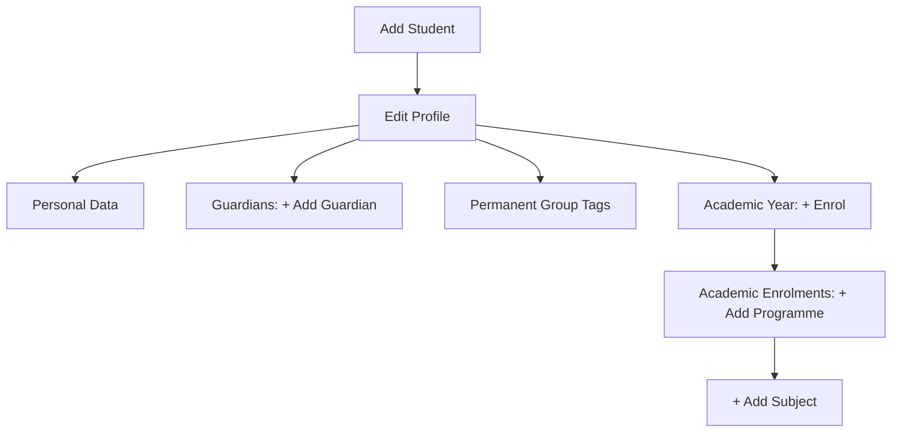

# The Student Setup Guide

Student creation includes:

- academic year enrolments and subject enrolments
- group tags and learner statuses for enhanced analysis and tracking
- guardian contact information to enable effective report sharing

## Student Registration Process

### Add student

### Edit profile
*   **Personal data**: Rellena la información básica del alumno.
*   **Guardians**: Haz clic en `+ Add Guardian` para vincular familiares.
*   **Permanent group tags**: Asigna etiquetas de análisis (SEN, Scholarship, etc.).

### Enrolment Process
1.  **Academic Year**: Haz clic en `+ Enrol` para el año actual.
2.  **Academic Enrolments**: Selecciona `+ Add programme`.
3.  **Subjects**: Añade las asignaturas finales con `+ Add subject`.
