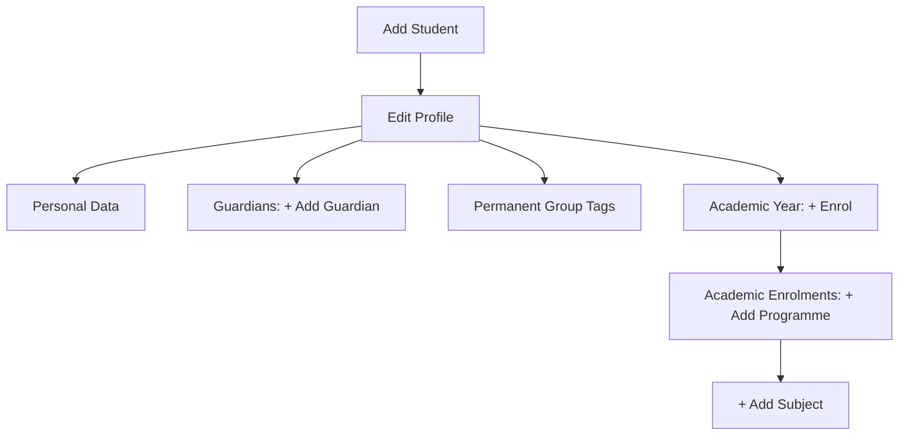

# The Student Setup Guide

Student creation includes:

- academic year enrolments and subject enrolments
- group tags and learner statuses for enhanced analysis and tracking
- guardian contact information to enable effective report sharing

# Student Registration Process

## Add student
### Edit profile

#### Personal data

#### Guardians: + Add Guardian

#### Permanent group tags

#### Academic Year: + Enrol

#### Academic Enrolments: + Add programme

##### + Add subeject
