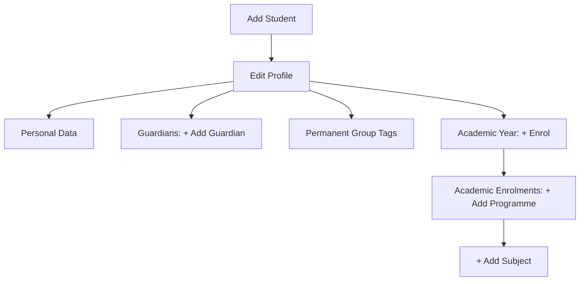

# The Student Setup Guide

## Student Registration Process

### Add student

Register a new student by entering their First Name and Last Name. You may also provide their Gender, Date of Birth, and Email Address as optional fields.

### Edit profile
*   **Personal data**: This section allows you to review and update the student's core information previously entered during registration.
*   **Guardians**: This section allows you to register one or multiple guardians by providing their Full Name and Email Address.
*   **Permanent group tags**: Assign one or multiple permanent tags to the student. Tags assigned here are permanent and will apply across all enrolment years.
!!! note "Tags must be previously created in `Setup > Students > Tags`"

### Enrolment Process
1.  **Academic Year**: Haz clic en `+ Enrol` para el año actual.
2.  **Academic Enrolments**: Selecciona `+ Add programme`.
3.  **Subjects**: Añade las asignaturas finales con `+ Add subject`.
