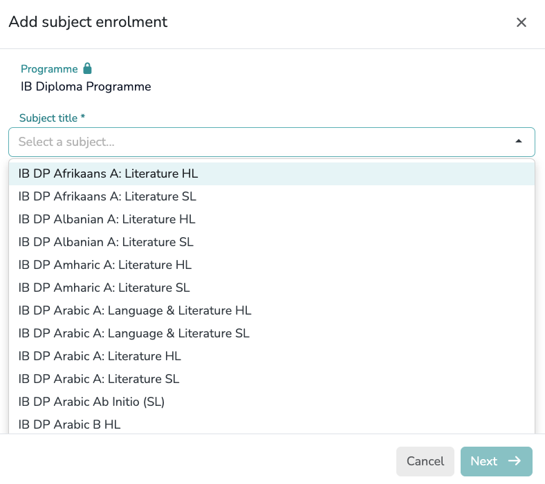

# The Student Setup Guide

## Student Registration Process

### Add student

{ width="700" }

Click the `Add student` button to begin the registration process. Enter the student's First Name and Last Name into the corresponding form to create the record. You may also provide their Gender, Date of Birth, and Email Address as optional fields.

### Edit profile
*   **Personal data**: This section allows you to review and update the student's core information previously entered during registration.
*   **Guardians**: This section allows you to register one or multiple guardians by providing their Full Name and Email Address.
!!! note "Assign a guardian to the student to enable progress report sharing"
*   **Permanent group tags**: Assign one or multiple permanent group tags to the student. Tags assigned here are permanent and will apply across all enrolment years. Their use enables student group analysis for insights based on demographics or specific cohorts.
!!! note "Group tags must be previously created in `Setup > Students > Tags`, clicking the `Group tags` button"

#### Enrolment Process
{ width="700" }

1.  **Academic Years**: Click on `+ Enrol` to associate the student with a specific Academic Year. This step is required to activate the student's record for the current cycle and enables their inclusion in specific year groups.

    !!! note "Student must be enrolled in an Academic Year before assigning a Programme"

    !!! warning "Review before saving"
        Please ensure the **Academic Year** and **Year Group** are correct. **These fields cannot be modified** once the enrolment is created.
    
    !!! info "Annual Group Tags"
        You can assign one or multiple tags to a student for a specific academic year. Unlike permanent tags, these are used to group students for academic purposes that may change from year to year.

    !!! info "Learner Statuses (Flags)"
        Assign one or multiple specific educational profiles to the student. These "flags" allow teachers and Data Managers to immediately identify and support specific student needs:

        *   **SEN (Special Educational Needs)**: The student has a learning difficulty or disability that requires special educational provision.
        *   **EAL (English as an Additional Language)**: The student's first language is not English and they may need support to access the curriculum.
        *   **LA (Low Attainer)**: The student is currently struggling to achieve the minimum expected academic standards for their level.
        *   **G&T (Gifted & Talented)**: The student demonstrates high ability in one or more academic, creative, or practical areas.
        *   **MP (Mobile Pupil)**: The student has joined the school outside the standard admission cycle or intake times.
        *   **OAGC (Out of Age Group Cohort)**: The student is not in the expected year group based on their chronological age.     

2.  **Academic Enrolments**: Select `+ Add programme` to assign the student to a programme and enable subject enrolment.

3.  **Subjects**: Locate the specific Programme section and click its corresponding `+ Add subject` button.

<table style="border: none; border-collapse: collapse; width: 100%; table-layout: fixed;">
  <tr style="border: none;">
    <td style="border: none; width: 50%; padding: 10px; text-align: center; vertical-align: top;">
      
    </td>
    <td style="border: none; width: 50%; padding: 10px; text-align: center; vertical-align: top;">
      
    </td>
  </tr>
</table>
**Step 1: Selection**  
Use the dropdown in the first form to select the required subject. Each option in the list is a **unique entry** that already includes its specific **Examination Board** and **Curriculum System** (e.g., **Cambridge**, **Pearson/Edexcel**, **Oxford/AQA**, or **International Baccalaureate**). Click `Next` to proceed.

**Step 2: Configuration**  
In the final form, select the **Academic Year** and the **Enrolment Type**:

!!! info "Enrolment Types"
    *   **Standard Enrolment**: For students following the regular internal course.
    *   **Exam Only**: This option allows exam results to be recorded ***without creating an internal enrolment record***. It is an efficient way to manage subject qualifications earned outside the institution by incoming students.

!!! note "Multi-Year Enrolment"
    Multiple academic years can be assigned to a single subject. This is useful when a subject spans two years or if a student requires additional time to complete the course.

!!! warning "Finalizing the Profile"
    After completing all sections—including **Personal Data**, **Guardians**, **Group Tags**, and **Enrolments**—you must click the `Done` button to save and synchronize the entire student record.

### Group tags

{ width="700" }

Click the `Group tags` button to create the specific tags required for your school. You can select one or multiple tags from the provided list or add your own custom labels. The standard categories include:

**Educational Needs**

*   **EAL**: English as an Additional Language.
*   **G&T / GIFTED**: Gifted and Talented students.
*   **IEP**: Individualized Education Program.
*   **SEN**: Special Educational Needs.

**Other Demographics**

*   **MOBILE**: Mobile Pupil (students joining outside the standard admission cycle).
*   **OAGC**: Out of Age Group Cohort.

!!! tip "Global Tags Setup"
    Setting up these **Group Tags** in `Setup > Students > Tags` ensures they are available as dropdown options when editing individual student profiles later.

---

## Practical Case Studies

Accurate student enrollment is the cornerstone of effective data management. Ensuring each student is correctly registered in the system is essential not only for assigning them to the appropriate **Teaching Groups** but also for:

1. **Academic Tracking:** Enabling the generation of **Expected Grades** and the scheduling of **Internal Grades**, including **Predicted**, **Attainment**, and **Target** grades.
2. **Examinations:** Managing the formal registration and recording of **Official Exam Results** once they are released by the awarding bodies.

The consistent effort of maintaining accurate student data—both personal details and enrollment—combined with the regular input of internal and external grades, empowers the school to:

*   **Deliver high-quality Progress Reports:** Generate automated and professional reports for students and parents.
*   **Track Individual Performance:** Analyze the current status and progress of every student in real-time.
*   **Monitor Subject & Cohort Trends:** Evaluate the evolution and academic health of specific subjects, year groups, or key stages.
*   **Measure Value-Added:** Analyze the progress made by students relative to their starting points and benchmark the school's performance against national or program averages.

---

### Case Study 1: Standard GCE AS & A-Level Pathway
*“Tracking linear subjects across multiple Exam Boards (AQA, Pearson, OCR) including a completed AS-Level and an independent research project (EPQ).”*

#### **Profile Overview**
This case represents a common Key Stage 5 (KS5) academic profile, combining a core set of linear subjects with elective components that conclude at different stages of the two-year cycle.

*   **Curriculum:** 3 Linear A-Levels (2-year duration).
*   **Modular Component:** 1 AS-Level completed in Year 12 (Further Mathematics).
*   **Independent Study:** 1 Extended Project Qualification (EPQ) completed in Year 13.
*   **External Accreditation:** 1 Language A-Level (Spanish) sat as "Exam Only" (Native speaker, non-taught).

#### **Application Enrollment View**

**2025/2026**

*   **Year 13**
*   **Group Tags:** `G&T`

*   **GCE AS & A levels (3)**

    *   `7408` | AQA Level 3 Advanced GCE in Physics
    *   `9MA0` | Pearson Edexcel Level 3 Advanced GCE in Mathematics
    *   `H446` | OCR Level 3 Advanced GCE in Computer Science

*   **Other Pre-university (KS5) Programmes (1)**

    *   `EPQ` | Extended Project Qualification

**2024/25**
*   **Year 12**

*   **GCE AS & A levels (4)**

    *   `7408` | AQA Level 3 Advanced GCE in Physics
    *   `9MA0` | Pearson Edexcel Level 3 Advanced GCE in Mathematics
    *   `H446` | OCR Level 3 Advanced GCE in Computer Science
    *   `8FM0` | Pearson Edexcel Level 3 Advanced Subsidiary GCE in Further Mathematics

*   **Other Pre-university (KS5) Programmes (1)**

    *   `EPQ` | Extended Project Qualification

**Exam Only**

*   **GCE AS & A levels (1)**

    *   `7692` | AQA Level 3 Advanced GCE in Spanish

---