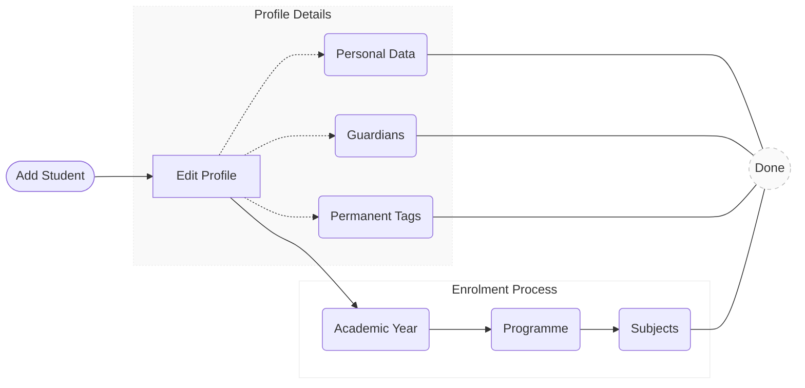

# The Student Setup Guide

## Student Registration Process

### Add student

{ width="700" }

Click the `Add student` button to begin the registration process. Enter the student's First Name and Last Name into the corresponding form to create the record. You may also provide their Gender, Date of Birth, and Email Address as optional fields.

### Edit profile
*   **Personal data**: This section allows you to review and update the student's core information previously entered during registration.
*   **Guardians**: This section allows you to register one or multiple guardians by providing their Full Name and Email Address.
!!! note "Assign a guardian to the student to enable progress report sharing"
*   **Permanent group tags**: Assign one or multiple permanent group tags to the student. Tags assigned here are permanent and will apply across all enrolment years. Their use enables student group analysis for insights based on demographics or specific cohorts.
!!! note "Group tags must be previously created in `Setup > Students > Tags`, clicking the `Group tags` button"

#### Enrolment Process
{ width="700" }

1.  **Academic Years**: Click on `+ Enrol` to associate the student with a specific Academic Year. This step is required to activate the student's record for the current cycle and enables their inclusion in specific year groups.

    !!! note "Student must be enrolled in an Academic Year before assigning a Programme"

    !!! warning "Review before saving"
        Please ensure the **Academic Year** and **Year Group** are correct. **These fields cannot be modified** once the enrolment is created.
    
    !!! info "Annual Group Tags"
        You can assign one or multiple tags to a student for a specific academic year. Unlike permanent tags, these are used to group students for academic purposes that may change from year to year.

    !!! info "Learner Statuses (Flags)"
        Assign one or multiple specific educational profiles to the student. These "flags" allow teachers and Data Managers to immediately identify and support specific student needs:

        *   **SEN (Special Educational Needs)**: The student has a learning difficulty or disability that requires special educational provision.
        *   **EAL (English as an Additional Language)**: The student's first language is not English and they may need support to access the curriculum.
        *   **LA (Low Attainer)**: The student is currently struggling to achieve the minimum expected academic standards for their level.
        *   **G&T (Gifted & Talented)**: The student demonstrates high ability in one or more academic, creative, or practical areas.
        *   **MP (Mobile Pupil)**: The student has joined the school outside the standard admission cycle or intake times.
        *   **OAGC (Out of Age Group Cohort)**: The student is not in the expected year group based on their chronological age.     

2.  **Academic Enrolments**: Select `+ Add programme` to assign the student to a programme and enable subject enrolment.

    !!! info "Add Programme"
        Within the form, you can select the most appropriate program for each student from the following options, organized by educational level:

        **Final Secondary (KS5)**

        *   **IB Diploma Programme**
        *   **GCE AS & A levels**
        *   **Level 3 Extended Project Qualifications**
        *   **International AS & A levels**
        *   **International Project Qualifications**
        *   **Other Pre-university (KS5) Programmes**

        **Upper Secondary (KS4)**

        *   **IB Middle Years Programme (Years 4–5)**
        *   **GCSEs**
        *   **Level 1 & 2 Project Qualifications**
        *   **International GCSEs**
        *   **O Levels**

        **Lower Secondary (KS3)**

        *   **International Lower Secondary Programme**

3.  **Subjects**: Locate the specific Programme section and click its corresponding `+ Add subject` button.

    <table style="border: none; border-collapse: collapse; width: 100%; table-layout: fixed;">
      <tr style="border: none;">
        <td style="border: none; width: 50%; padding: 10px; text-align: center; vertical-align: top;">
          
        </td>
        <td style="border: none; width: 50%; padding: 10px; text-align: center; vertical-align: top;">
          
        </td>
      </tr>
    </table>

    **Step 1: Selection**  
    Use the dropdown in the first form to select the required subject. Each option in the list is a **unique entry** that already includes its specific **Examination Board** and **Curriculum System** (e.g., **Cambridge**, **Pearson/Edexcel**, **Oxford/AQA**, or **International Baccalaureate**). Click `Next` to proceed.

    **Step 2: Configuration**  
    In the final form, select the **Academic Year** and the **Enrolment Type**:

    !!! info "Enrolment Types"
        *   **Standard Enrolment**: For students following the regular internal course.
        *   **Exam Only**: This option allows exam results to be recorded ***without creating an internal enrolment record***. It is an efficient way to manage subject qualifications earned outside the institution by incoming students.

    !!! note "Multi-Year Enrolment"
        Multiple academic years can be assigned to a single subject. This is useful when a subject spans two years or if a student requires additional time to complete the course.

    !!! warning "Finalizing the Profile"
        After completing all sections—including **Personal Data**, **Guardians**, **Group Tags**, and **Enrolments**—you must click the `Done` button to save and synchronize the entire student record.

### Group tags

{ width="700" }

Click the `Group tags` button to create the specific tags required for your school. You can select one or multiple tags from the provided list or add your own custom labels. The standard categories include:

**Educational Needs**

*   **EAL**: English as an Additional Language.
*   **G&T / GIFTED**: Gifted and Talented students.
*   **IEP**: Individualized Education Program.
*   **SEN**: Special Educational Needs.

**Other Demographics**

*   **MOBILE**: Mobile Pupil (students joining outside the standard admission cycle).
*   **OAGC**: Out of Age Group Cohort.

!!! tip "Global Tags Setup"
    Setting up these **Group Tags** in `Setup > Students > Tags` ensures they are available as dropdown options when editing individual student profiles later.

---

## Student registration guidelines

### GCE AS & A-Level
*“Integrating linear subject tracking with a completed AS-Level and independent research certification.”*

#### **Application Enrollment View**

| Subject title | Enrolled in |
| :--- | :--- |
| **GCE AS & A levels** | |
| AQA Level 3 Advanced GCE in Physics (7408) | 2025/26 – Year 13   2024/25 – Year 12 |
| AQA Level 3 Advanced GCE in Spanish (7692) | **Exam only** |
| OCR Level 3 Advanced GCE in Computer Science (H446) | 2025/26 – Year 13   2024/25 – Year 12 |
| Pearson Edexcel Level 3 Advanced GCE in Mathematics (9MA0) | 2025/26 – Year 13   2024/25 – Year 12 |
| Pearson Edexcel Level 3 Advanced Subsidiary GCE in Further Mathematics (8FM0) | 2024/25 – Year 12 |
| | |
| **Level 3 Extended Project Qualifications** | |
| Pearson Edexcel Level 3 Extended Project Qualification | 2025/26 – Year 13 |

#### **Key Considerations**

!!! info "Linear Subject"
    For linear subjects all grades recorded in the application (**Internal and Expected**) refer to the **entire qualification**. Since there is only one final exam, the system compares all grades against each other and against a **single Final Exam Grade**. This allows the application to track the student's overall progress and calculate the **Value-Added** provided by the school.

---

### International AS & A levels
*“A comprehensive summary of international curricula: combining CIE, OxfordAQA, and Pearson Edexcel.”*

#### **Application Enrollment View**

| Subject title | Enrolled in |
| :--- | :--- |
| **International AS & A levels** | |
| Cambridge International GCE A level in Media (9607) | 2025/26 – Year 13 |
| Cambridge International GCE AS level in Media (9607) | 2024/25 – Year 12 |
| OxfordAQA International A level in Economics (9640) | 2025/26 – Year 13 |
| OxfordAQA International AS level in Economics (9640) | 2024/25 – Year 12 |
| Pearson Edexcel International A level in Mathematics (YMA01) | 2025/26 – Year 13 |
| Pearson Edexcel International AS level in Mathematics (XMA01) | 2024/25 – Year 12 |
| Pearson Edexcel International AS level in Further Mathematics (XFM01) | 2024/25 – Year 12 |
| Cambridge International GCE A level in Law (9084) | **Exam only** |
| Cambridge International GCE AS level in Law (9084) | **Exam only** |
| | |
| **International Project Qualifications** | |
| Cambridge International Project Qualification | 2025/26 – Year 13 |

#### **Key Considerations**

!!! info "Staged Subjects"

    
---

### International Baccalaureate (IB) Diploma
*“Recording a full IB Diploma profile using numerical grading (1-7), HL/SL distinctions, and Core (A–E) components.”*

| Subject title | Enrolled in |
| :--- | :--- |
| **IB Diploma Programme** | |
| IB DP English A: Lang & Lit HL (Group 1) | 2025/26 – Grade 12   2024/25 – Grade 11 |
| IB DP Spanish B SL (Group 2) | 2025/26 – Grade 12   2024/25 – Grade 11 |
| IB DP Geography HL (Group 3) | 2025/26 – Grade 12   2024/25 – Grade 11 |
| IB DP Biology SL (Group 4) | 2025/26 – Grade 12   2024/25 – Grade 11 |
| IB DP Mathematics: Analysis and Approaches HL (Group 5) | 2025/26 – Grade 12   2024/25 – Grade 11 |
| IB DP Visual Arts SL (Group 6) | 2025/26 – Grade 12   2024/25 – Grade 11 |
| | |
| **IB Core Components** | |
| IB DP Theory of Knowledge (TOK) | 2025/26 – Grade 12   2024/25 – Grade 11 |
| IB DP Extended Essay (EE) | 2025/26 – Grade 12   2024/25 – Grade 11 |
| IB DP Creativity, Activity, Service (CAS) | 2025/26 – Grade 12   2024/25 – Grade 11 |

<!-- 
---

### Case Study 4: Multi-Board IGCSE Integration & Science Rationalization
*“A strategic demonstration of Key Stage 4 curriculum design: balancing core sciences via the Combined route while unifying dual grading scales (9-1 and A*-G) across three international boards.”*

#### **Profile Overview**
This case study illustrates the application’s ability to manage the transition between traditional and reformed grading scales at the IGCSE level. It highlights the "Single Award" science logic and the inclusion of Level 2 independent research (HPQ) as a curriculum enhancer.

*   **Science Optimization:** Implementation of **Combined Science (0653)** to provide a broad scientific foundation within a single-credit framework.
*   **Dual-Scale Calibration:** Simultaneous tracking of **Numerical (9-1)** and **Alphabetic (A*-G)** results in a unified student transcript.
*   **Breadth & Specialization:** A balanced portfolio covering STEM, Humanities, Languages, and Vocational studies (Business/Media).
*   **Early Research Skills:** Integration of the **AQA Level 2 HPQ** to bridge the gap between IGCSE and future A-Level/IPQ research requirements.

#### **Application Enrollment View**

| Subject title | Enrolled in |
| :--- | :--- |
| **International GCSEs** | |
| Cambridge IGCSE (9-1) in Mathematics (0980) | 2025/26 – Year 11   2024/25 – Year 10 |
| Cambridge IGCSE (9-1) in Spanish (7160) | 2025/26 – Year 11   2024/25 – Year 10 |
| **Cambridge IGCSE in Combined Science (0653)** | **2025/26 – Year 11   2024/25 – Year 10** |
| **Cambridge IGCSE in History (0470)** | **2025/26 – Year 11   2024/25 – Year 10** |
| OxfordAQA IGCSE (9-1) in Media Studies (9257) | 2025/26 – Year 11   2024/25 – Year 10 |
| Pearson Edexcel International GCSE (9-1) in Business (4BS1) | 2025/26 – Year 11   2024/25 – Year 10 |
| Pearson Edexcel International GCSE (9-1) in English Language A (4EA1) | 2025/26 – Year 11   2024/25 – Year 10 |
| | |
| **Level 1 & 2 Project Qualifications** | |
| **AQA Level 2 Higher Project Qualification (HPQ)** | **2025/26 – Year 11   2024/25 – Year 10** |

#### **Key Considerations**

!!! info "The 'Combined Science' Logic"
    Unlike 'Co-ordinated' or 'Triple' routes, **Combined Science (0653)** is treated by the system as a **Single Award (1 IGCSE)**. The application maps Biology, Chemistry, and Physics components into a single terminal grade, optimizing the student's timetable for additional electives like Business and Media.

!!! info "Cross-Board Grading Alignment"
    The system performs real-time normalization between boards:
    *   **9-1 Scale (Edexcel/OxfordAQA/CIE):** Standardized for subjects like English and Maths.
    *   **A*-G Scale (CIE History/Science):** The application retains the legacy alphabetic format for these specific codes (0470/0653) while providing equivalency mapping for internal school reporting.

---

### Case Study 5: The Triple Science Specialist (STEM-Driven Profile)
*“A specialized STEM-oriented IGCSE pathway: focusing on independent science disciplines while integrating Cambridge’s numerical Mathematics for a high-rigor foundation.”*

#### **Profile Overview**
This case demonstrates the application's ability to handle the "Triple Science" route. It rejects grouped models in favor of three distinct reporting streams (Biology, Chemistry, Physics), providing a more granular academic record for future STEM specialization.

*   **Independent Science Stream:** Three separate Pearson Edexcel IGCSEs (4BI1, 4CH1, 4PH1), explicitly avoiding the Combined or Co-ordinated awards.
*   **Numerical Maths Integration:** Utilization of **Cambridge (0980)** to ensure a 9-1 graded foundation in Mathematics.
*   **High-Rigor Academic Load:** A 9-qualification portfolio designed for students targeting Medicine, Engineering, or Pure Sciences at Key Stage 5.
*   **Technical Breadth:** Inclusion of Computer Science and Geography to complement the scientific analytical framework.

#### **Application Enrollment View**

| Subject title | Enrolled in |
| :--- | :--- |
| **International GCSEs** | |
| **Cambridge IGCSE (9-1) in Mathematics (0980)** | **2025/26 – Year 11   2024/25 – Year 10** |
| **Pearson Edexcel International GCSE in Biology (4BI1)** | **2025/26 – Year 11   2024/25 – Year 10** |
| **Pearson Edexcel International GCSE in Chemistry (4CH1)** | **2025/26 – Year 11   2024/25 – Year 10** |
| **Pearson Edexcel International GCSE in Physics (4PH1)** | **2025/26 – Year 11   2024/25 – Year 10** |
| Pearson Edexcel International GCSE (9-1) in English Language A (4EA1) | 2025/26 – Year 11   2024/25 – Year 10 |
| Pearson Edexcel International GCSE (9-1) in Spanish (4SP1) | 2025/26 – Year 11   2024/25 – Year 10 |
| Cambridge IGCSE (9-1) in Geography (0976) | 2025/26 – Year 11   2024/25 – Year 10 |
| OxfordAQA IGCSE (9-1) in Computer Science (9210) | 2025/26 – Year 11   2024/25 – Year 10 |
| | |
| **Level 1 & 2 Project Qualifications** | |
| **AQA Level 2 Higher Project Qualification (HPQ)** | **2025/26 – Year 11   2024/25 – Year 10** |

#### **Key Considerations**

!!! info "Disaggregated Science Logic"
    By not utilizing **Combined** or **Co-ordinated** sciences, the system tracks three independent grades. This prevents a lower performance in one discipline from "diluting" the student's overall scientific profile, a critical distinction for highly selective university admissions.

!!! info "Advanced Research Foundation"
    The **HPQ** in this profile is recorded as a skills-based qualification. This allows the center to track the development of independent study habits early, serving as a critical data point for predicting success in Year 12/13 research-heavy subjects.

---

### Case Study 6: GCE O-Level Regional Pathway (Legacy & Commonwealth)
*“Managing traditional GCE Ordinary Level (O-Level) qualifications: focusing on alphabetic grading (A*–E) and terminal assessment models in regional markets.”*

#### **Profile Overview**
This case study demonstrates the application's compatibility with the GCE O-Level system, widely used in Singapore, Pakistan, and Mauritius. It highlights the system's ability to process legacy alphabetic grading while maintaining the same tracking rigor as modern IGCSEs.

*   **Traditional Rigor:** A 7-subject O-Level portfolio focused on academic core disciplines.
*   **Alphabetic Grading (A*–E):** All subjects utilize the standard GCE O-Level scale, requiring the system to map results against international benchmarks.
*   **Regional Specialization:** Inclusion of Islamic Studies (2068) and Sociology (2251), common in South Asian and Middle Eastern centers.
*   **Single-Board Loyalty:** A 100% Cambridge (CIE) profile, typical of centers operating under National Equivalency requirements.

#### **Application Enrollment View**

| Subject title | Enrolled in |
| :--- | :--- |
| **GCE O Levels** | |
| Cambridge O Level Mathematics (4024) | 2025/26 – Year 11   2024/25 – Year 10 |
| Cambridge O Level English Language (1123) | 2025/26 – Year 11   2024/25 – Year 10 |
| Cambridge O Level Physics (5054) | 2025/26 – Year 11   2024/25 – Year 10 |
| Cambridge O Level Chemistry (5070) | 2025/26 – Year 11   2024/25 – Year 10 |
| Cambridge O Level Sociology (2251) | 2025/26 – Year 11   2024/25 – Year 10 |
| Cambridge O Level Islamic Studies (2068) | 2025/26 – Year 11   2024/25 – Year 10 |
| Cambridge O Level Economics (2281) | 2025/26 – Year 11   2024/25 – Year 10 |

#### **Key Considerations**

!!! info "Legacy Grading Logic"
    Unlike IGCSEs that often use the 9-1 scale, **GCE O Levels** consistently use the **A* to E** scale. The application ensures that internal targets and predicted grades are restricted to this alphabetic format to match the official statement of results issued by Cambridge.

!!! info "Terminal Assessment Focus"
    O-Level subjects are strictly linear. The application records all internal mock results as direct indicators of the final terminal exam performance, providing specific **Value-Added** metrics based on the historical difficulty of O-Level grade thresholds compared to IGCSE.

!!! info "Equivalency Mapping"
    For students moving from O-Levels to IB or A-Levels, the system provides a background mapping (e.g., Grade B = Level 6) to allow for seamless transition tracking within the student’s lifelong academic record.
-->
