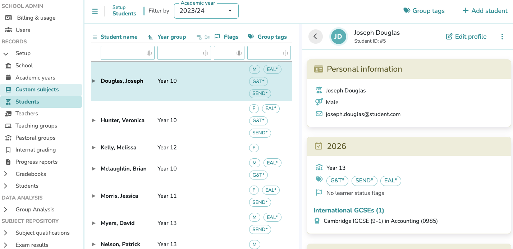
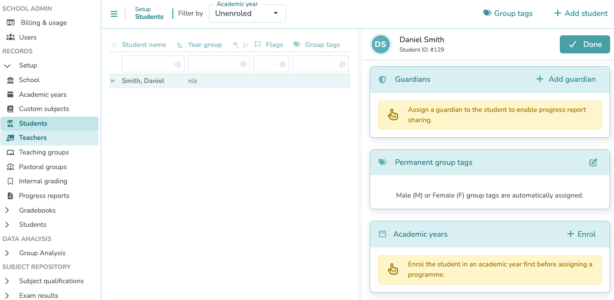
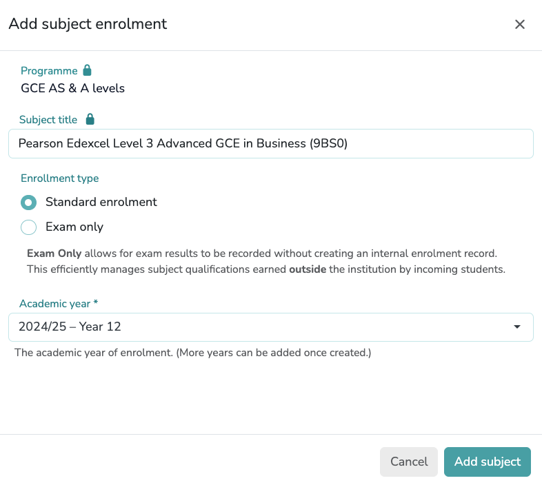
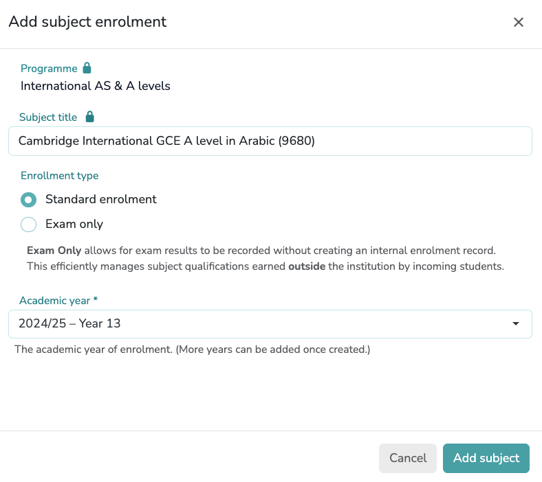

# The Student Setup Guide

## Student Registration Process

### Add student
{ width="710" }

Register a new student by entering their First Name and Last Name. You may also provide their Gender, Date of Birth, and Email Address as optional fields.

### Edit profile
*   **Personal data**: This section allows you to review and update the student's core information previously entered during registration.
*   **Guardians**: This section allows you to register one or multiple guardians by providing their Full Name and Email Address.
!!! note "Assign a guardian to the student to enable progress report sharing"
*   **Permanent group tags**: Assign one or multiple permanent group tags to the student. Tags assigned here are permanent and will apply across all enrolment years. Their use enables student group analysis for insights based on demographics or specific cohorts.
!!! note "Tags must be previously created in `Setup > Students > Tags`, clicking the `Group tags` button"

#### Enrolment Process
{ width="710" }

1.  **Academic Years**: Click on `+ Enrol` to associate the student with a specific Academic Year. This step is required to activate the student's record for the current cycle and enables their inclusion in specific year groups.

    !!! success "Student must be enrolled in an Academic Year before assigning a Programme"

    !!! warning "Review before saving"
        Please ensure the **Academic Year** and **Year Group** are correct. **These fields cannot be modified** once the enrolment is created.
    
    !!! info "Annual Group Tags"
        You can assign one or multiple tags to a student for a specific academic year. Unlike permanent tags, these are used to group students for academic purposes that may change from year to year.

2.  **Academic Enrolments**: Select `+ Add programme` to assign the student to a programme and enable subject enrolment.

3.  **Subjects**: Locate the specific Programme section and click its corresponding `+ Add subject` button. The following form will appear:

{ width="550" }

Use the dropdown to select the required subject. Each option in the list is a **unique entry** that already includes its specific **Examination Board** and **Curriculum System** (e.g., **Cambridge**, **Pearson/Edexcel**, **Oxford/AQA**, or **International Baccalaureate**).

After completing the selection, click the `Next` button to proceed to the final configuration form:

{ width="550" }
/// caption
Adding Subject
///

Use this form to select the **Academic Year** and the **Enrolment Type**:

!!! info "Enrolment Types"
    *   **Standard Enrolment**: For students following the regular internal course.
    *   **Exam Only**: This option allows exam results to be recorded ***without creating an internal enrolment record***. It is an efficient way to manage subject qualifications earned outside the institution by incoming students.

!!! note "Multi-Year Enrolment"
    Multiple academic years can be assigned to a single subject. This is useful when a subject spans two years or if a student requires additional time to complete the course.

!!! warning "Finalizing the Profile"
    After completing all sections—including **Personal Data**, **Guardians**, **Group Tags**, and **Enrolments**—you must click the `Done` button to save and synchronize the entire student record.

### Group tags

