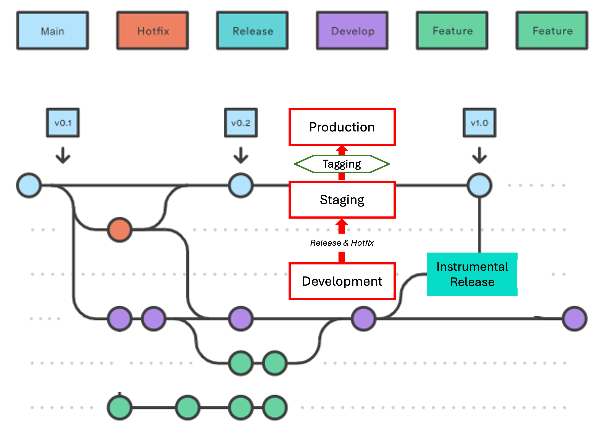

# Deploying Software

## GitFlow: Branching Strategy

{ width=100% style="display:block; margin:0 auto;" }

#### `main`
Permanent production branch. Updated only when a new release is promoted (deployed to Production) from a `Release` or `Hotfix` branch. Each promoted release is recorded with a corresponding Git tag and Docker image.

#### `dev`
Permanent development branch. Commits accumulate here until a new version is ready for staging.

#### `Release`
Temporary branch created from `dev` when a version is ready for staging.

- Created (on GitHub) from `dev`.
- Deployed to Staging for validation.
- Promotion: the current commit is tagged, and the tagged image is deployed to Production (no rebuild).
- Merged into `main` via hard reset, then deleted.

#### `Hotfix`
Temporary branch created from `main` for urgent production fixes.

- Created (on GitHub) from `main`.
- A single fix commit is applied on GitHub (or via terminal), then deployed to Staging for validation.
- Promotion: the current commit is tagged, and the tagged image is deployed to Production (no rebuild).
- Merged into `main`, then back into `dev` via pull request.
- Deleted after both merges are complete.

---

## Connecting to the Server

All deployment operations run on the Hetzner server. Connect and navigate to the project directory:

```bash
ssh root@46.62.132.133
```

```bash
cd ~/gradewing/gradewing
```

The prompt should read `root@gradewing-server:~/gradewing/gradewing#`. All commands in the sections below assume this working directory.

Set execution permissions:

```bash
chmod +x ./run/*.sh
```


---

## Release Deployment: Staging

### 1. Create the Release branch

**Via GitHub UI:**
- Go to **Branches → New branch**
- Name: `Release` — Source: `dev`

**Via terminal:**
```bash
git checkout dev           # Switch to the source branch
```

```bash
git pull origin dev        # Ensure dev is up to date before branching
```

```bash
git checkout -b Release    # Create and switch to the new Release branch
```

```bash
git push origin Release    # Publish the branch to GitHub
```

### 2. Fetch and check out the Release branch

```bash
git fetch origin        # Download all remote branch updates from GitHub
```

```bash
git checkout Release    # Switch the working directory to the Release branch
```

```bash
git pull origin Release # Ensure the local branch matches the remote
```

### 3. Deploy to Staging

**Option A – Keep existing Staging data:**
```bash
./run/03-start_staging.sh
```

**Option B – Reset Staging data (optionally restore from Production):**
```bash
./run/04-stop_staging.sh
```

```bash
./run/03-start_staging.sh
```

```bash
./run/21-restore_to_staging.sh   # Optional: seed Staging with current Production data
```

### 4. Clean up Docker resources

Remove orphaned volumes and dangling images left over from the previous build:

```bash
docker volume prune
```

```bash
docker image prune
```

Verify Staging

```bash
./run/31-check_staging.sh
```

---

## Staging Validation Failure: Delete Release

If Staging validation fails, delete the Release branch and fix changes in the `dev` branch accordingly.

### 1. Delete the Release branch

```bash
git fetch origin
```

```bash
git checkout main          # Move off Release before deleting it
```

```bash
git branch -D Release      # Delete the local branch
```

```bash
git push origin --delete Release   # Delete the remote branch on GitHub
```

### 2. Confirm branch state

```bash
git branch -a
```

Expected output:
```
* main
  remotes/origin/HEAD -> origin/main
  remotes/origin/dev
  remotes/origin/main
```

---

## Release Deployment: Production

If Staging validation is successful, the Python/Django image from Staging (gradewing-web:staging) can be promoted to Production without rebuilding. This ensures the exact same code is running in both environments.


### 1. Tag the Docker image & create a GitHub Tag

List existing image versions to determine the next tag. For a Release, increment the **major** digit (e.g. `v2.3` → `v3.0`):

```bash
docker images --format "{{.Tag}}\t{{.CreatedSince}}" gradewing-web | grep "^v"
```

Run the tagging script (it will prompt for the new version). The script creates the Git tag and also tags the staging Docker image with that same version:

```bash
./run/10-tag_web.sh
```

Confirm the tag was applied:

```bash
docker images --format "{{.Tag}}\t{{.CreatedSince}}" gradewing-web | grep "^v"
```

### 2. Deploy to Production 

Deploys the tagged image built on Staging — no rebuild occurs:

```bash
./run/05-start_production.sh
```

```bash
check-prod
```

Check state:

```bash
./run/32-check_production.sh
```
### 3. Merge Release into `main`

Bring `main` up to date locally, then advance it to match the Release branch exactly:

```bash
git fetch origin
```

```bash
git checkout main
```

```bash
git pull origin main       # Confirm main is current (should already be up to date)
```

```bash
git reset --hard Release   # Move main's pointer to the tip of Release
```

Verify `main` and `Release` are now identical (no output means they match):

```bash
git diff main..origin/Release
```

Push the updated `main` to GitHub:

```bash
git push origin main --force
```

Confirm the remote branches also match (no output expected):

```bash
git diff origin/main..origin/Release
```

Show any `dev` commits not yet in `main` (pending future work):

```bash
git log main..origin/dev --oneline
```

### 4. Delete the Release branch

```bash
git branch -D Release               # Delete local branch
```

```bash
git push origin --delete Release    # Delete remote branch on GitHub
```

Confirm branch state

```bash
git branch -a
```

Expected output:
```
* main
  remotes/origin/HEAD -> origin/main
  remotes/origin/dev
  remotes/origin/main
```

---

## Hotfix Deployment

### 1. Create the Hotfix branch

**Via GitHub UI:**
- Go to **Branches → New branch**
- Name: `Hotfix` — Source: `main`

**Via terminal:**
```bash
git checkout main          # Switch to the source branch
```

```bash
git pull origin main       # Ensure main is up to date before branching
```

```bash
git checkout -b Hotfix     # Create and switch to the new Hotfix branch
```

```bash
git push origin Hotfix     # Publish the branch to GitHub
```

### 2. Apply the fix

**Via GitHub UI:**

1. Select the `Hotfix` branch from the branch dropdown.
2. Navigate to the file(s) to fix and click the pencil icon (**Edit this file**).
3. Make the changes.
4. Scroll to **Commit changes**, add a descriptive title, select **Commit directly to the Hotfix branch**, and click **Commit changes**.

**Via terminal:**
```bash
# Edit the file(s), then:
```

```bash
git add <file>                       # Stage the changed file(s)
```

```bash
git commit -m "fix: <description>"  # Commit with a descriptive message
```

```bash
git push origin Hotfix               # Push the fix to GitHub
```

### 3. Fetch and check out the Hotfix branch

```bash
git fetch origin           # Download the Hotfix branch from GitHub
```

```bash
git checkout Hotfix        # Switch the working directory to the Hotfix branch
```

```bash
git pull origin Hotfix     # Ensure the local branch matches the remote
```


### 4. Deploy to Staging

**Option A – Keep existing Staging data:**
```bash
./run/03-start_staging.sh
```

**Option B – Reset Staging data (optionally restore from Production):**
```bash
./run/04-stop_staging.sh
```

```bash
./run/03-start_staging.sh
```

```bash
./run/21-restore_to_staging.sh   # Optional: seed Staging with current Production data
```

### 6. Clean up Docker resources

Remove orphaned volumes and dangling images left over from the previous build:

```bash
docker volume prune
```

```bash
docker image prune
```

Verify Staging

```bash
check-stage
```

### 7. Tag the Docker image and create a Git Tag

List existing image versions. For a Hotfix, increment the **minor** digit (e.g. `v2.3` → `v2.4`):

```bash
docker images --format "{{.Tag}}\t{{.CreatedSince}}" gradewing-web | grep "^v"
```

Run the tagging script (it will prompt for the new version). The script creates the Git tag and also tags the staging Docker image with that same version:

```bash
./run/10-tag_web.sh
```

Confirm the tag was applied:

```bash
docker images --format "{{.Tag}}\t{{.CreatedSince}}" gradewing-web | grep "^v"
```

### 9. Deploy to Production and Verify

Deploys the tagged image built on Staging — no rebuild occurs:

```bash
./run/05-start_production.sh
```

```bash
./run/32-check_production.sh
```

### 10. Merge Hotfix into `main`

```bash
git fetch origin
```

```bash
git checkout main
```

```bash
git pull origin main
```

```bash
git merge Hotfix --ff-only   # Fast-forward: applies the Hotfix commits directly onto main with no merge commit
```

Verify `main` and `Hotfix` are identical (no output expected):

```bash
git diff main..origin/Hotfix
```

Push to GitHub:

```bash
git push origin main
```

### 11. Merge `main` into `dev`

Synchronise the fix into the development branch so it is not lost in future releases.

**Via GitHub Pull Request:**

1. Open a **New pull request** on GitHub.
2. Set **base**: `dev` — **compare**: `main`.
3. If GitHub shows **Able to merge**, click **Create pull request**.
4. Click **Merge pull request → Create a merge commit → Confirm merge**.

**Via terminal:**
```bash
git fetch origin
```

```bash
git checkout dev
```

```bash
git pull origin dev        # Ensure dev is current
```

```bash
git merge main             # Merge main's fix commits into dev
```

```bash
git push origin dev        # Push the updated dev branch to GitHub
```

### 12. Delete the Hotfix branch

```bash
git branch -d Hotfix               # Delete local branch
```

```bash
git push origin --delete Hotfix    # Delete remote branch on GitHub
```

### 13. Confirm branch state

```bash
git branch -a
```

Expected output:
```
* main
  remotes/origin/HEAD -> origin/main
  remotes/origin/dev
  remotes/origin/main
```


